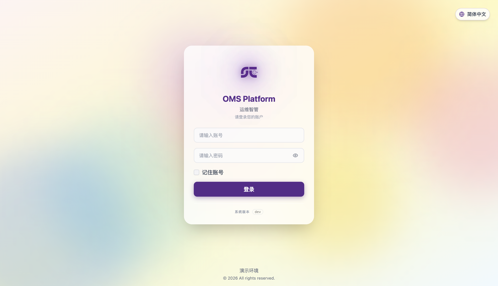
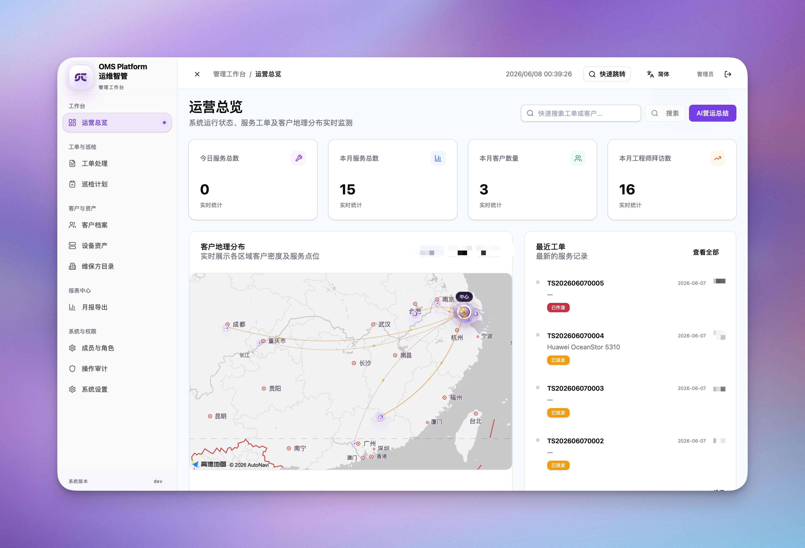

# OMS Platform 運維智管

<p align="right">
  <a href="./README.md">🌐 English</a> ·
  <a href="./README.zh-CN.md">🇨🇳 简体中文</a> ·
  <strong>繁體中文</strong>
</p>

OMS Platform（中文名：運維智管）是一套面向現場運維、售後服務和客戶資產管理的工單協同平台。當前版本採用統一管理工作臺，並在管理端提供工程師工單填寫入口。



> 公開截圖請使用演示資料或脫敏資料，不包含真實客戶、工單、手機號、地址、簽名、Token 或其他隱私資料。涉及真實資料時請使用實心遮罩或馬賽克處理。

## 介面預覽

### 管理工作臺



### 新建服務表


### 客戶維護資訊


## 使用說明

- [English user guide](docs/wiki/user-guide.en.md)
- [中文使用說明](docs/wiki/user-guide.md)
- [簡體中文使用說明](docs/wiki/user-guide.zh-CN.md)
- [繁體中文使用說明](docs/wiki/user-guide.zh-TW.md)

## 核心能力

- **統一入口**：`frontend-admin` 提供統一登入頁和管理工作臺。
- **管理工作臺**：工單處理、工單填寫、客戶資產、設備資產、維護單位、巡檢計畫、月報、使用者與審計管理。
- **工程師工單填寫入口**：工程師側填單已整合到管理端 `工單填寫` 頁面。
- **服務記錄閉環**：支援現場、遠端、內勤記錄，覆蓋提交、補填、分享匯出與月報統計。
- **設備型號自動補全**：設備型號 catalog 支援多詞搜尋、別名歸一化和 fixture 同步。
- **多工作臺權限**：工程師、工程主管、主管、管理員等角色按工作臺和介面權限隔離。
- **生產部署腳本**：透過 `scripts/deploy.sh` 完成 Git 同步、後端 Docker rebuild、前端構建和 dist 上傳。

## 專案結構

```text
.
├── backend                         # Node.js + Express + MySQL API
├── frontend-admin                  # React + Vite，統一登入入口與管理工作臺
├── scripts                         # 部署與維護腳本
│   ├── deploy.sh                   # 全量/分模組部署
│   └── deploy-seed.sh              # 設備型號 catalog fixture 部署
├── AGENTS.md                       # 部署與權限約定
└── README.md
```

## 統一登入與工作臺跳轉

- 統一登入頁：`frontend-admin/src/pages/Login.tsx`
- 應用名稱配置：`frontend-admin/src/config/app.ts`

常見入口：

- 管理端：`https://<admin-domain>/login`
- 工程師工單填寫：透過管理端入口登入後打開 `工單填寫`。

## 本地啟動

### 後端

```bash
cd backend
npm install
cp .env.example .env
npm start
```

預設 API 地址：

- `http://127.0.0.1:3000/api/v1`

資料庫初始化參考：

- [backend/schema.sql](backend/schema.sql)

建立管理員帳號：

```bash
cd backend
ADMIN_PASSWORD='replace-with-a-strong-password' npm run create-admin
```

寫入輕量演示資料：

```bash
cd backend
SEED_DEMO_PASSWORD='replace-with-a-strong-password' node scripts/seed-demo.js
```

### 管理工作臺 / 統一入口

```bash
cd frontend-admin
npm install
npm run dev
```

本地環境變數範例：

```bash
VITE_API_BASE_URL=http://127.0.0.1:3000/api/v1
```

## 構建與檢查

```bash
cd backend && npm run check
cd frontend-admin && npm run build
cd frontend-admin && npx tsc --noEmit
```

## 部署

真實 SSH 目標、遠端目錄、域名、Cookie 網域和 CORS 白名單屬於私有部署資訊，不寫入公開倉庫。請放在 `AGENTS.local.md`、`docs/deploy.local.md`、`scripts/deploy.local.env`，以及各端 `.env.local` 或生產環境變數檔中。

部署腳本從目前 shell 環境或本地 `scripts/deploy.local.env` 讀取真實配置。

| 變數 | 說明 |
|---|---|
| `DEPLOY_SSH_TARGET` | SSH 主機別名或目標 |
| `DEPLOY_REMOTE_ROOT` | 遠端專案根目錄 |
| `DEPLOY_BACKEND_RELATIVE` | 後端目錄相對遠端根目錄的位置，預設 `app/backend` |
| `DEPLOY_SITE_RELATIVE` | 前端站點目錄相對遠端根目錄的位置，預設 `app/site` |
| `DEPLOY_BACKEND_CONTAINER` | 後端容器名，僅 `deploy-seed.sh` 需要 |
| `DEPLOY_PROJECT_SLUG` | 臨時歸檔名前綴，預設 `oms-platform` |
| `DEPLOY_BRANCH` | Git 目標分支，預設目前分支 |
| `CORS_ALLOWED_ORIGINS` | 後端允許的前端 Origin，以逗號分隔 |
| `SESSION_COOKIE_DOMAIN` | 需要跨子網域共享登入狀態時配置 |

如需多套環境，可在 `scripts/deploy.local.env` 中定義 `DEPLOY_<PROFILE>_*` 變數，然後使用 `bash scripts/deploy.sh <profile> <target>`。

```bash
# 預設環境（讀取 DEPLOY_* 或 scripts/deploy.local.env）
bash scripts/deploy.sh all
bash scripts/deploy.sh backend
bash scripts/deploy.sh frontend
bash scripts/deploy.sh admin

# 指定本地私有 profile（profile 變數在 scripts/deploy.local.env 中定義）
bash scripts/deploy.sh <profile> all
bash scripts/deploy.sh <profile> backend
bash scripts/deploy.sh <profile> front
bash scripts/deploy.sh <profile> admin
```

部署流程：推送目前分支到 GitHub，上傳後端原始碼，重建後端 Docker 容器，構建管理端前端，然後上傳 `dist`。舊 `engineer` / `eng` 部署目標已廢棄。工程師側工單填寫由統一管理端前端提供。

`deploy.sh` 不會自動提交。工作區存在未提交變更時，腳本會列出檔案並退出。部署前請先檢查並提交變更，避免誤發布敏感或無關檔案。

環境變數範例：

```bash
export DEPLOY_SSH_TARGET=<ssh-alias-or-host>
export DEPLOY_REMOTE_ROOT=<remote-project-root>
export DEPLOY_BACKEND_RELATIVE=app/backend
export DEPLOY_SITE_RELATIVE=app/site
export DEPLOY_PROJECT_SLUG=oms-platform
```

### 發布檢查清單

- 執行部署前保持 `git status` 乾淨。
- 後端改動執行 `cd backend && npm run check`。
- 前端改動執行 `cd frontend-admin && npm run build` 和 `cd frontend-admin && npx tsc --noEmit`。
- 涉及管理端可見功能、頁面展示、互動或發布內容變更時，同步提升 `frontend-admin/package.json`、`frontend-admin/package-lock.json` 和 `frontend-admin/src/config/app.ts` 中 `APP_VERSION` fallback 的版本號。
- 涉及後端套件發布語義變化時，同步更新 `backend/package.json` 與 `backend/package-lock.json`。
- 提交訊息使用中文，一行主旨概括動作與對象；需要正文時用 `-` 列出要點。

部署後請在伺服器驗證後端狀態，因為 `deploy.sh` 本身不做健康檢查：

```bash
docker ps --filter name=backend --format '{{.Status}}'
docker logs --tail 20 <backend容器名>
docker exec <backend容器名> wget -qO- http://127.0.0.1:3000/api/v1/health
```

健康檢查應返回 `{"ok":true}`。排查生產 500 時查看 `docker logs <backend容器名>`；後端錯誤處理器會記錄請求路徑和堆疊。

設備型號 catalog fixture 部署：

```bash
bash scripts/deploy-seed.sh
```

## 角色與權限

| 角色 | 管理端 |
|---|---|
| `engineer`（工程師） | 僅使用工單填寫入口，介面按本人過濾 |
| `engineering_supervisor`（工程主管） | 可使用工單填寫入口；派單管理可見全部工單 |
| `operations_director`（營運負責人） | 可見全部工單 |
| `administrative_supervisor`（行政主管） | 管理端業務資料唯讀，不可派單、審批、編輯、刪除或改設定 |
| `admin`（管理員） | 全部權限 |

工單填寫入口請求本人相關資料時帶 `?mine=1`，後端據此過濾 `effectiveEngineerId`。

## 隱私與截圖規範

公開 README 和演示材料中請避免展示真實營運資料。必須打碼或替換：

- 客戶名稱、聯絡人、手機號、郵箱、地址、定位資訊
- 工單號、服務內容、故障描述、內部備註、審核意見
- 設備序列號、資產編號、IP/主機名、保固資訊
- 工程師姓名、頭像、手機號、手寫簽名
- 審計日誌、上傳檔名、Token、Cookie、密碼、API Key、`.env` 內容

推薦公開截圖優先使用：統一登入頁、空白/演示資料工作臺、空白新建服務表。涉及真實資料時優先使用實心遮罩，其次再使用模糊或馬賽克。

## 授權與維護

OMS Platform 是依據 **GNU General Public License v3.0（GPL-3.0）** 發布的自由軟體。你可以在 GPL-3.0 條款下使用、學習、修改和再發布本軟體。任何修改版或再發布版本都必須繼續保留 GPL-3.0 授權條款，並按授權要求提供相應原始碼。

本倉庫為 OMS Platform 運維智管的正式專案倉庫。生產部署和權限約定可參考 [AGENTS.md](AGENTS.md)。
